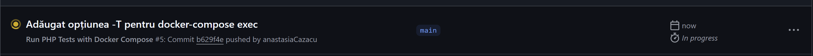
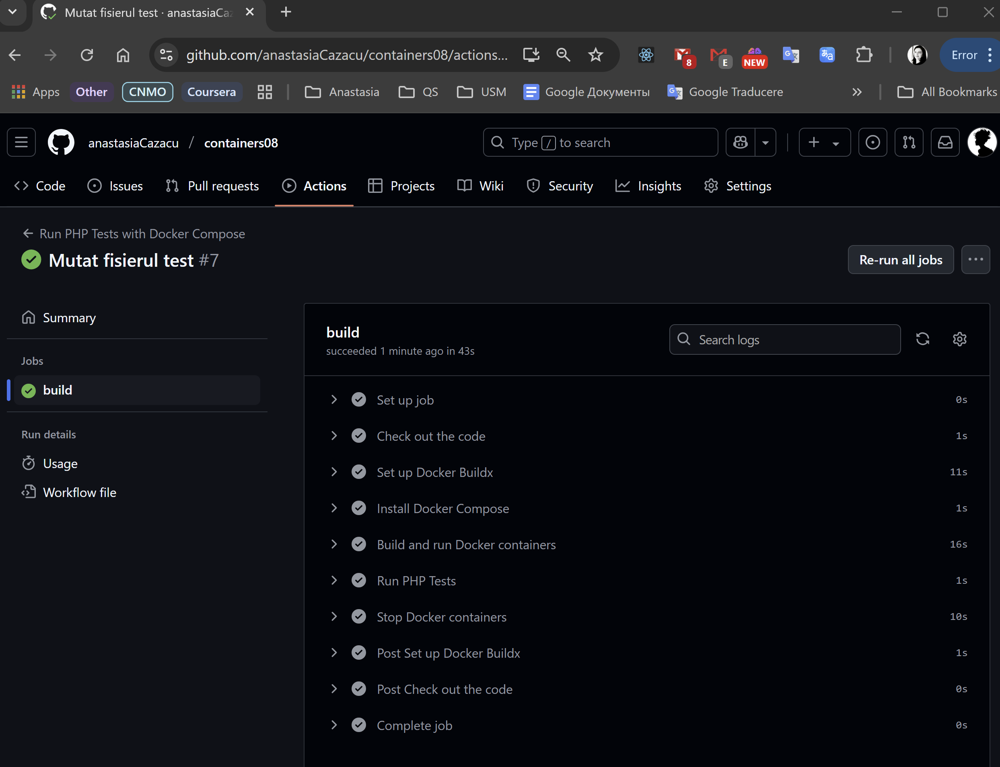

# containers08

## Scopul lucrării

În cadrul acestei lucrări învățat să configurez integrarea continuă cu ajutorul Github Actions.

## Sarcina

Crearea unei aplicații Web, scrierea testelor pentru aceasta și configurarea integrării continue cu ajutorul Github Actions pe baza containerelor.

## Pregătire

Docker - instalat.

## Efectuarea lucrării

### Descrierea lucrului cu Git-ul

1. M-am conectat la contul meu de GitHub.
2. Am dat click pe "New repository".
3. Am denumit repository-ul, am bifat să fie inițializat cu un fișier nou `README.md` și l-am creat.
4. Am clonat repository-ul în Visual Studio (VS) Code:

   - `git clone https://github.com/anastasiaCazacu/containers08.git` - clonez repository-ul.
   - `cd containers08` - accesez folderul clonat.
   - `git checkout -B lab08` - creez branchiul si ma mut pe el si modific fisierul meu README.MD si ulterior doar adaug continutul.
   - `git add *` - adaug tot continutul.
   - `git status` - verific statutul si ma asigur ca am modificarile dorite.
   - `git commit -m "structure defined"` - creez commitul
   - `git push origin lab08` - push commit în depozitul de la distanță
   - `git checkout main`- Comut pe branch-ul principal
   - `git merge lab08`- Integrez (merge) branch-ul nou în main.
   - `git push origin main` - Împing schimbările pe GitHub.

   ### Descrierea efectuarii lucrarii

Creez structura propusa:

```text
site
├── modules/
│   ├── database.php
│   └── page.php
├── templates/
│   └── index.tpl
├── styles/
│   └── style.css
├── config.php
└── index.php
```

si fisierele propuse spre creare
`git add .`
`git commit -m "Initial commit "`
`git push`



- dupa mai multe incercari printre altele si calile gresite dar am obtinut in : Verificand în fila „Actions” pe GitHub dacă apare jobul și primesc ✅ Super tare! 🎉
  

## Răspunsul intrebarilor

1. Ce este integrarea continuă?
   Integrarea continuă (Continuous Integration - CI) este un proces prin care modificările aduse codului sunt testate și verificate automat, de fiecare dată când sunt adăugate în proiect (prin push sau pull request). Scopul acestui proces este de a detecta rapid eventualele erori și de a preveni integrarea codului defectuos.

2. Pentru ce sunt necesare testele unitare?
   Testele unitare verifică funcționarea corectă a părților mici (unități) ale aplicației — cum ar fi funcții, metode sau clase. Ele sunt necesare pentru:

```txt
a. Detectarea rapidă a bug-urilor;

b. Asigurarea că noile modificări nu strică funcționalitatea existentă;

c. Creșterea încrederii în cod (mai ales când sunt schimbări mari);

d. Automatizarea verificării codului în procesul de CI(Integrarea continuă).
```

3.
