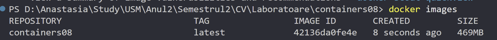

# containers08

## Scopul lucrării

În cadrul acestei lucrări învățat să configurez integrarea continuă cu ajutorul Github Actions.

## Sarcina

Crearea unei aplicații Web, scrierea testelor pentru aceasta și configurarea integrării continue cu ajutorul Github Actions pe baza containerelor.

## Pregătire

Docker - instalat.

## Efectuarea lucrării

### Descrierea lucrului cu Git-ul

1. M-am conectat la contul meu de GitHub.
2. Am dat click pe "New repository".
3. Am denumit repository-ul, am bifat să fie inițializat cu un fișier nou `README.md` și l-am creat.
4. Am clonat repository-ul în Visual Studio (VS) Code:

   - `git clone https://github.com/anastasiaCazacu/containers08.git` - clonez repository-ul.
   - `cd containers08` - accesez folderul clonat.
   - `git checkout -B lab08` - creez branchiul si ma mut pe el si modific fisierul meu README.MD si ulterior doar adaug continutul.
   - `git add *` - adaug tot continutul.
   - `git status` - verific statutul si ma asigur ca am modificarile dorite.
   - `git commit -m "structure defined"` - creez commitul
   - `git push origin lab08` - push commit în depozitul de la distanță
   - `git checkout main`- Comut pe branch-ul principal
   - `git merge lab08`- Integrez (merge) branch-ul nou în main.
   - `git push origin main` - Împing schimbările pe GitHub.

   ### Descrierea efectuarii lucrarii

Creez structura propusa:

```
site
├── modules/
│   ├── database.php
│   └── page.php
├── templates/
│   └── index.tpl
├── styles/
│   └── style.css
├── config.php
└── index.php
```

```
containers08/
├── sql/
│   └── schema.sql
├── site/
│   ├── modules/
│   ├── templates/
│   ├── styles/
│   ├── config.php
│   └── index.php
├── Dockerfile
├── .github/
│   └── workflows/
│       └── main.yml
├── tests/
│   ├── testframework.php
│   └── tests.php
└── README.md
```

- Rulez `docker build -t containers08 .`

- Verific starea: `docker images`



- Rulez containerului Docker. Creez și să rulez containerul din această imagine pentru a porni aplicația: `docker run -d -p 8080:80 --name crafti_app containers08
`
